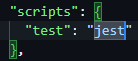

# COMP2068 - JavaScript Unit Testing Tutorial

This module will teach you how to perform basic unit testing using the testing framework Jest. This repo will have the functions prepared for demonstration. The goal of this tutorial is to learn to program unit tests and not the functions that need to be tested.

You will need the following technologies for this tutorial:
- VSCode
- Node.js
- NPM
- Jest

## Step 1. Clone this repository

Clone this repository on your machine with the following command:

```git clone https://github.com/roseemi/COMP2068_JS_Unit_Testing.git```

## Step 2. Install the Jest framework

Install the dependency as a devDependency using the following command:

```npm i jest -D```

## Step 3. Change test value in package.json

Change the test value under scripts in package.json to "jest"

